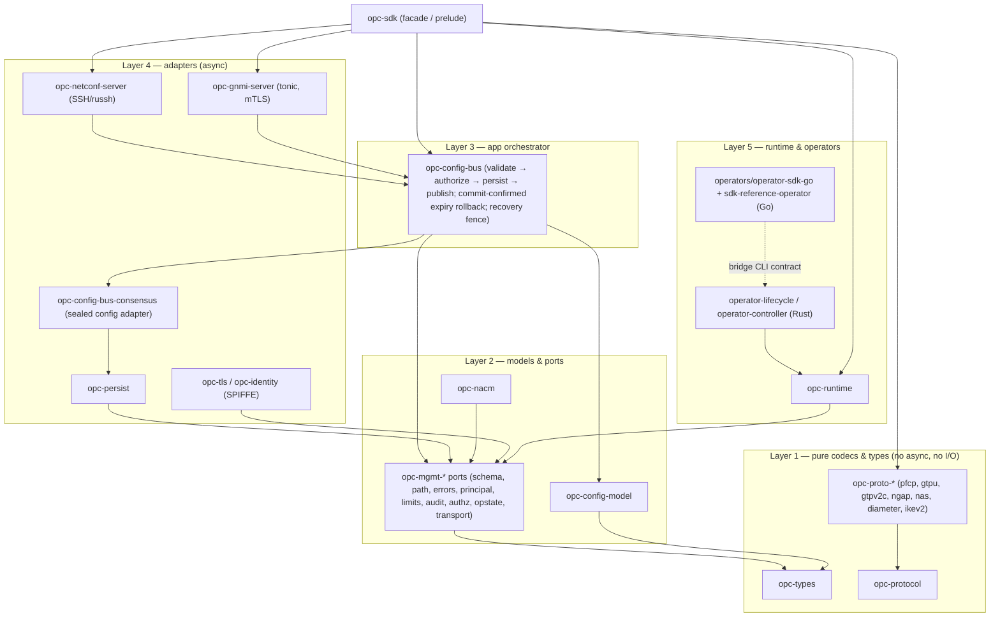

# Architecture

Layered view of the SDK. Arrows point in the dependency direction (inward).

Legend: solid arrows are Cargo dependencies (direction = "depends on"); the dashed
edge is the Go↔Rust policy-CLI process boundary (JSON contract, versioned by
`scripts/check-downstream-import.sh` on the Go side).
