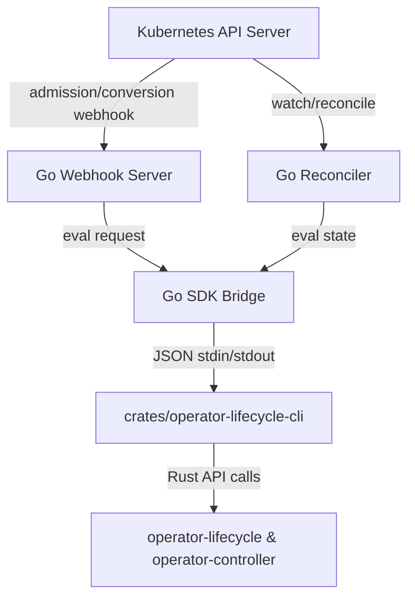

# Go SDK Reference Operator Harness

This module implements a minimal Go `controller-runtime` reference operator harness that demonstrates how Kubernetes controller integration can consume OpenPacketCore SDK lifecycle contracts.

> [!IMPORTANT]
> **Hard Reference Boundary**
> This operator is a reference harness and development toolkit. It is explicitly **NOT** a production operator for any specific Network Function (such as AMF, SMF, UPF, or OpenPacketCore itself) and does not encode any CNF-specific reconciliation behaviors. Production operators must build their own controller wrappers consuming these SDK primitives.

## Architecture

The architecture maintains a clean polyglot separation of concerns:
1. **Rust SDK Policy Core (Policy Ownership)**: 
   - Lifecycle decision logic
   - Admission policy checks
   - Compatibility matrix validation
   - Data-plane preflight validation
   - Migration/drain decision helpers
2. **Go Kubernetes Integration (Kubernetes API Plumbing)**:
   - CRD API types (`v1alpha1` and `v1beta1` with custom conversion)
   - `controller-runtime` manager & reconciler
   - Validating and conversion webhooks
   - Status & Conditions updates
   - RBAC, Leader Election, and Cert-Manager Kustomize manifests
   - Go unit and fake-client integration tests



## Rust-Go Boundary (SDK Bridge)

The integration uses a secure, versioned, schema-driven CLI boundary. The Go package `internal/sdkbridge` runs the compiled `operator-lifecycle-cli` Rust binary, passing JSON requests via standard input and reading JSON responses via standard output.

The bridge enforces that:
- All inputs and outputs conform to strict versioned JSON schemas.
- Error messages returned across the boundary are sanitized to prevent leakage of paths, bearer tokens, PEM certificate material, SQL details, or subscriber identifiers (IMSI/SUPI/GPSI).
- Webhook validation **fails closed** in Production mode.

## Project Layout

- `api/v1alpha1/` & `api/v1beta1/`: CRD definitions for `SdkManagedNetworkFunction`. Contains webhook conversion logic.
- `cmd/manager/`: Entrypoint of the controller-manager binary registering reconcilers, validators, and webhook server.
- `internal/controller/`: Reconciler loop observing CRD state, running CLI evaluations, and updating status conditions.
- `internal/webhook/`: Validating webhook ensuring SPIFFE, KMS, and HA compatibility rules are respected.
- `internal/sdkbridge/`: Go adapter for spawning and communicating with the Rust CLI helper.
- `config/`: Kustomize manifests for CRDs, RBAC, deployment, webhooks, and cert-manager configuration.

## Development & Testing

### Prerequisites

Ensure you have Go, Rust, and `kubectl` (or `kustomize`) installed. The Go tests build the Rust CLI automatically with `cargo build -p operator-lifecycle-cli` before bridge-dependent cases run.

### Running Tests

Run the Go unit and integration tests:

```bash
go test ./... -v
```

These tests verify admission validation, conversion, reconciliation phases, rendered manifest syntax, and JSON contract correctness under fake-client configurations. They do not replace a downstream CNF operator's envtest or kind/end-to-end suite.

### Packaging Note

The reference manager image must package both the Go manager binary and the Rust policy CLI. The deployment manifest sets:

```text
OPERATOR_LIFECYCLE_CLI_PATH=/usr/local/bin/operator-lifecycle-cli
```

Downstream CNF teams can use a different path, but they must set `OPERATOR_LIFECYCLE_CLI_PATH` or place `operator-lifecycle-cli` on the container `PATH`.

### Generating Kustomize Manifests

To compile the entire reference deployment manifest, run:

```bash
kubectl kustomize config/default
```
